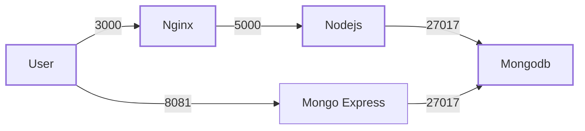

#Overview
This exercise is to understand the build and flow of a full stack app.
We will enter data in the frontend and view that data in the backend.

## HLD

#Setup procedure

1. Run docker-compose.yml file
`docker compose docker-compose.yml up`
2. From browser go to localhost:3000 and enter username/password
3. Open another tab with localhost:8081 to view data in mongodb
`username:admin, password: pass`

[1^]: Built docker images are uploaded into Docker Hub
: Versions of the images used are mentioned in the Dockerfile