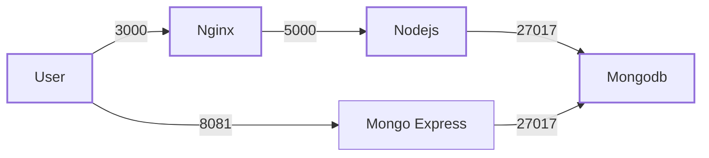

## HLD

```mermaid
graph LR
    %% Define Nodes
    USER[User]
    FE[Nginx]
    MID[Nodejs]
    BE[Mongodb]
    BEUI[Mongo Express]

    %% Define Connnections with Ports
    USER -->|3000| FE
    USER -->|8081| BEUI
    FE -->|5000| MID
    MID -->|27017| BE
    BEUI -->|27017| BE

    %% Styling
    style USER fill:#blue,stroke:#black,stroke-width:2px
    style FE fill:#blue,stroke:#black,stroke-width:2px
    style MID fill:#blue,stroke:#black,stroke-width:2px
    style BE fill:#blue,stroke:#black,stroke-width:2px
```